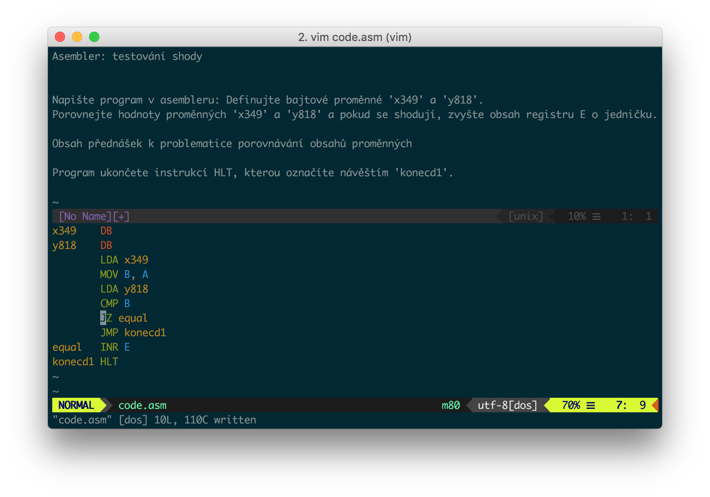

# Brandejsův-ASM.vim

Plugin do Vimu pro ty, kterým se nechtějí vyplňovat cvičení na assembler v Laboratořích [PB151](https://is.muni.cz/predmet/fi/podzim2017/PB151) v prohlížeči.



## Instalace
Pokud používáte [Vundle](https://github.com/VundleVim/Vundle.vim), stačí do vašeho `.vimrc` přidat
```vim
Plugin 'xxdavid/brandejsuv-asm.vim'
```

Dále ve `.vimrc` deklarujte proměnné s cookies nějaké vaší do ISu přihlášené session (např. Firefox je zobrazuje v Network panelu DevTools) a ID semestru (paramert `obdobi` v URL):
```vim
let g:is_muni_issession = 'lol'
let g:is_muni_iscreds = 'rofl'
let g:is_muni_term = '7023'
```

### Závislosti
* Python 3.6+
* Beautiful Soup (`pip install beautifulsoup4`)
* requests (`pip install requests`)

## Příkazy
`:BrandejsAsmTask n` (kde `n` je název (číslo) úlohy bez počátečního „i“) načte zadání úlohy do horního okna.

`:BrandejsAsmUpload n` nahraje řešení z právě editovaného souboru do Laboratoře a buď vypíše chyby, nebo řekne, že máte splněno. (Taky to  teda může spadnout.)

`:BrandejsAsmUploadCurrent` nahraje řešení k úloze, ke které bylo naposledy staženo zadání.

## Disclaimer
Kód je místy pěkně nepěkný, ale protože je quick-and-dirty a už ho nikdy neuvidím, je mi to docela ukradené.

## Doporučení
Protože Vim syntaxi osmdesátosmdesátkového asssembleru v základu nezná, doporučuji nainstalovat [vim-m80](https://github.com/oraculo666/vim-m80)
```vim
Plugin 'oraculo666/vim-m80'
```

A tuhle řádku ve `.vimrc` taky doporučuju (za předpokladu, že váš soubor s kódem má příponu `asm`)
```vim
autocmd FileType asm set autoindent noexpandtab tabstop=8 shiftwidth=8 ft=m80
```
